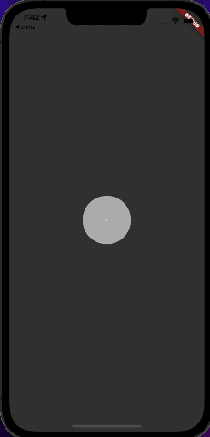

# Clima ☁

## Application Demo

The objective of this tutorial is to learn about asynchronous programming in Dart. We'll look at how to carry out time consuming tasks such as getting device location and networking to get data from the internet.

## About

This is a weather app which fetches live weather data in the current location of the device as well as the weather for any city you can think of! This app contains an apiKey which is used to fetch data from the openweathermap api. 

